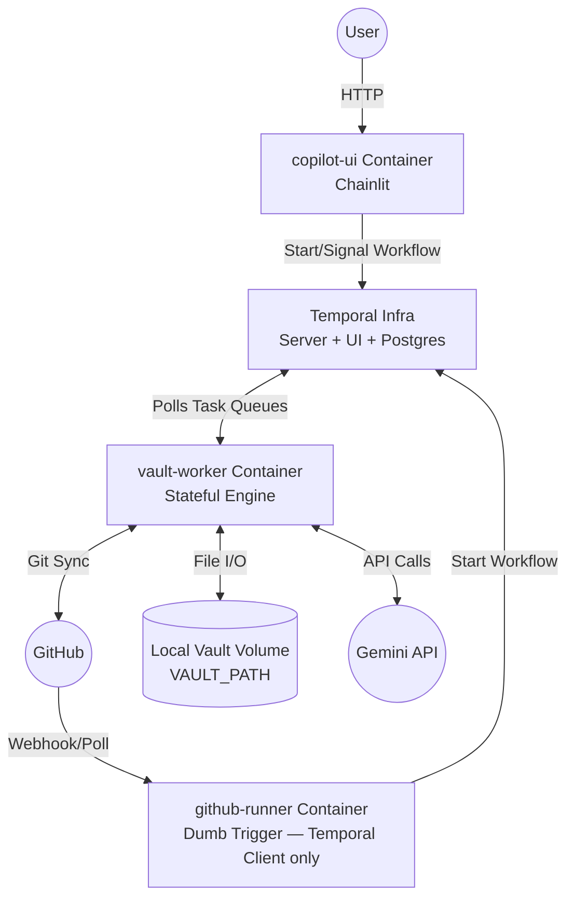
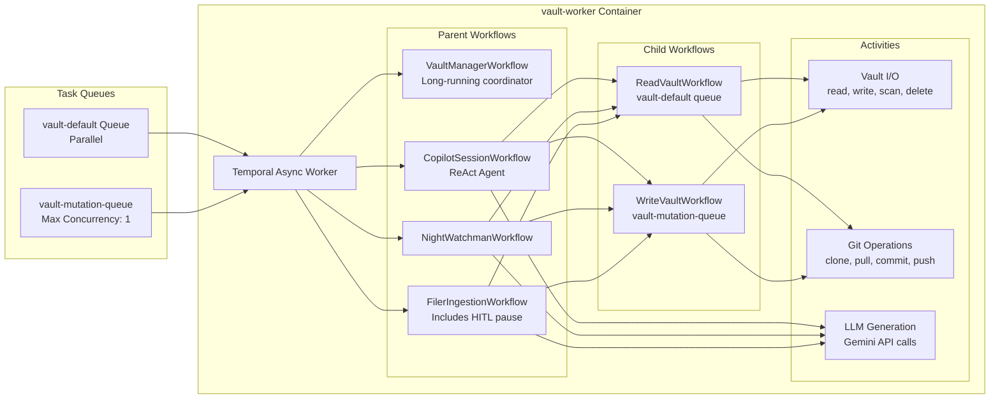

## Version History

| Version | Date | Author | Changes |
| :--- | :--- | :--- | :--- |
| 1.0 | 2026-04-06 | CJK | Initial draft, generated from plan development discussion |
| 1.1 | 2026-04-06 | cc-obsidian | **Section 2:** Extended Current State with src_v2 → Temporal mapping table. **Section 3:** Clarified github-runner as Dumb Trigger (github-gateway/FastAPI is a future TRD). **Section 4:** Added NightWatchman audit behavior from codebase; updated Filer HITL to Chainlit Signal/Query pattern; added brief ReAct description. **New Section 4.5:** Queue configuration. **New Section 4.6:** Workflow Signal/Query interface specifications. **New Section 4.7:** Core domain models with discussion of Project/Area/Product relationships. **Section 5:** Updated monorepo structure. **Section 6:** Clarified Phase 0 dummy vault spec; added startup workflow; noted Phase 4 dumb-trigger implementation. **New Section 7:** Vault synchronisation strategy (PAT, startup workflow, sync policies). **New Section 8:** Deployment port reference. |
| 1.2 | 2026-04-11 | cc-obsidian | **Sections 3, 4, 4.5, 4.6, 6, 7.3, 7.4:** Renamed `VaultInitWorkflow` → `VaultManagerWorkflow`; redesigned as a long-running coordinator using Temporal Updates (`ensure_synced`) so `ReadVaultWorkflow` delegates pull-if-stale decisions to it rather than tracking `last_synced` itself; added `continue_as_new` cadence requirement. **Section 4 `CopilotSessionWorkflow`:** Added session storage reconnection pattern — Chainlit stores `workflow_id` in browser session storage and reconnects on page load rather than starting a new workflow. **Section 4.6 `FilerIngestionWorkflow`:** Added Advanced Visibility dependency note — `list_workflows` requires Temporal visibility configured against Postgres, not ElasticSearch. **Section 4 Phase 4:** Updated copilot-ui description to include session storage reconnection flow. **Section 4.7:** Fixed deprecated `datetime.utcnow` → `datetime.now(timezone.utc)` (Python 3.12). **Section 8:** Corrected port 7234 → 7235. |

---

## 1. Executive Summary & Goals

The Obsidian Copilot & Automation Engine is transitioning from a tightly coupled, monolithic script base to a Temporal-backed Service-Oriented Architecture (SOA).

**Core Objectives:**

1. **Fault Tolerance:** Utilize Temporal for native retries on flaky LLM/network calls.

2. **Concurrency Control:** Enforce parallel reads (for speed) and strictly sequential writes (to prevent Git/file-system collisions).

3. **Agent-Friendly Testability:** Architect the system so AI coding agents can independently build, test, and prove components using mocked external states before touching production data.

4. **Decoupled Deployment:** Separate the orchestrator, UI, and background triggers into distinct containers managed within a monorepo.

---

## 2. Current State vs. Target State

### Current State (V1)

- **Orchestrator:** GitHub Actions.
- **Compute:** A self-hosted GitHub Runner executing bash/Python monoliths; Chainlit running directly on the host VM.
- **Testing:** Difficult to test end-to-end without mutating the actual vault or spending LLM credits.

#### src_v2 Module → Temporal Target Mapping

| src_v2 Module | Role in V1 | Temporal V2 Target |
| :--- | :--- | :--- |
| `use_cases/ingestion_service.py` | Orchestrates inbox processing | Activities in `vault-worker` |
| `use_cases/filer_service.py` | Executes `librarian: file` proposals | Activities in `vault-worker` |
| `use_cases/maintenance_service.py` | Audit + fix proposal generation | Activities in `vault-worker` |
| `use_cases/librarian_service.py` | Code registry generation | Activity in `vault-worker` |
| `use_cases/assistant_service.py` | Context loading for LLM | Activity in `vault-worker` |
| `use_cases/proposal_service.py` | LLM proposal generation | LLM Activity in `vault-worker` |
| `infrastructure/file_system/adapters.py` | Vault read/write/scan | Vault I/O Activities |
| `infrastructure/llm/adapters.py` | Gemini API calls | LLM Activity |
| `infrastructure/testing/adapters.py` | Fake LLM for tests | Fake LLM service in `tests/mocks/` |
| `core/domain/models.py` | Pydantic models | Migrated and extended in `packages/shared/` |
| `core/interfaces/ports.py` | Abstract interfaces | Superseded by Temporal Activity contracts |
| `entrypoints/chainlit_app.py` | Chainlit UI with direct vault access | Refactored to Temporal Client in `copilot-ui` |
| `entrypoints/ingest_runner.py` | Runs ingestion pipeline | Replaced by Temporal workflow triggered by github-runner |
| `entrypoints/cron_runner.py` | Runs maintenance pipeline | Replaced by Temporal workflow triggered by github-runner |
| `entrypoints/cli.py` | Manual invocation | Retained for local debugging only |
| `config/settings.py` | Environment configuration | Migrated per-container to Docker env vars |

**Modules to discard:**
- `core/interfaces/ports.py`: The abstract port/adapter pattern is superseded by Temporal's Activity contract model. The interfaces were valuable for V1 testing; in V2, the Temporal test environment and Fake LLM replace this pattern.

### Target State (V2)

- **Orchestrator:** Temporal Server (self-hosted via Docker, backed by PostgreSQL).
- **Compute:** A stateful `vault-worker` container executing isolated Workflows and Activities.
- **Clients:** A stateless `copilot-ui` (Chainlit) and a `github-runner` acting as a "Dumb Trigger" Temporal Client.
- **Testing:** A robust `pytest` suite utilising `temporalio.testing`, a mocked file system, and a Fake LLM service.
- **Python Version:** 3.12. Fully supported by the `temporalio` SDK; provides improved error messages (valuable for Temporal debugging), `@override` typing support, and a ~5% performance improvement over 3.11. No breaking changes from the existing `src_v2` dependency set.

---

## 3. Architecture Diagrams

### A. Container Diagram (Deployment & Networking)

> **Note on `github-runner`:** In this TRD (V2.0), the existing GitHub Actions self-hosted runner is retained as a "Dumb Trigger" — its YAML is stripped of all vault logic and only executes a Temporal SDK call to start a workflow. A replacement `github-gateway` (stateless FastAPI service receiving GitHub webhooks directly) is out of scope and will be addressed in a subsequent TRD.



**Container Roster:**

| Container | Type | Image | State |
| :--- | :--- | :--- | :--- |
| `postgres` | Infra | External (`postgres:16`) | Stateful (DB volume) |
| `temporal-server` | Infra | External (`temporalio/server`) | Stateful (Postgres-backed) |
| `temporal-ui` | Infra | External (`temporalio/ui`) | Stateless |
| `vault-worker` | Temporal Worker | Custom (GHCR, built in CI) | Stateful (vault disk) |
| `copilot-ui` | Temporal Client | Custom (GHCR, built in CI) | Stateless |
| `github-runner` | Temporal Client | Custom (GHCR, built in CI) | Stateless |

Three custom images are built and pushed to GHCR on merge to `main`. The three Temporal infra images are pulled directly from their upstream registries.

### B. Component Diagram (Logical Execution inside Vault Worker)



---

## 4. Core Temporal Primitives

### Parent Workflows (The Orchestrators)

**`VaultManagerWorkflow`**
Starts on `vault-worker` startup and runs indefinitely as the vault's single state coordinator. Handles initial vault validation (see Section 7.3 for startup logic), then stays alive to track `last_synced` and coordinate read sync across all other workflows.

To avoid Temporal's event history size limit, the workflow calls `workflow.continue_as_new()` on a daily cadence (or after a configurable number of Update events), carrying forward only its essential state (`last_synced` timestamp).

**`CopilotSessionWorkflow`**
One Chainlit session = one workflow execution. Runs a hand-rolled ReAct agent loop (implementation detailed in the corresponding Bubble). The loop:
1. Blocks on an incoming user message Signal.
2. Builds a prompt from the chat history and available tools.
3. Calls the LLM Activity (returns either a direct response or a tool call).
4. If a tool call: dispatches to the appropriate child workflow or activity, appends the result to history.
5. Repeats until no further tool calls; emits the final response to history.
6. Returns to blocking state, awaiting the next user message Signal.

Chat history lives in the Workflow's state — Chainlit is stateless and retrieves it via Query on each render. To survive browser refreshes, Chainlit stores the active `workflow_id` in the browser's session storage on session start. On page load, it checks session storage for an existing ID; if found, it reconnects to that running workflow (via Query to restore chat history) rather than starting a new one. The `ai-agent-handbook` by vasilyevdm is a useful reference for ReAct pattern variants; full implementation is deferred to the Bubble.

**`NightWatchmanWorkflow`**
Triggered by the `github-runner` on a nightly cron schedule. Audits the vault using the rules defined in the existing `ObsidianFileSystemAdapter._validate_note`:

- **Rule 1 — Missing metadata** (+10): note has no aliases and no tags.
- **Rule 2 — Code mismatch** (+50): note's filename stem does not begin with the expected project/area code for its folder. *Not evaluated if Rule 3 also fires on the same file — a generically named file predictably lacks a code prefix, so both firing would double-penalise the same underlying condition.*
- **Rule 3 — Generic filename** (+20): filename stem (case-insensitive) is one of `untitled`, `meeting`, `note`, `call`.

Scan scope: `20. Projects/` and `30. Areas/`. Excluded directories: `99. System`, `00. Inbox`, `.git`, `.obsidian`, `.trash`.

Produces fix proposals for the **up to 10 highest-scoring files** (sorted by score descending). Opens a GitHub Pull Request containing the proposals for user review.

**`FilerIngestionWorkflow`**
Triggered by `github-runner` when a file is added to `00. Inbox/0. Capture/`. Flow:
1. Runs `ReadVaultWorkflow` to gather vault context (skeleton, code registry, system instructions).
2. Calls LLM Activity to generate a `FilingProposal` (proposed path, frontmatter, reasoning).
3. **Pauses** — sets status to `awaiting_approval` and blocks on an `approve` or `reject` Signal.
4. On `approve`: dispatches to `WriteVaultWorkflow` to write the note to the proposed path.
5. On `reject`: terminates without mutating the vault.

The HITL interaction happens via Chainlit: the user can see pending proposals (via Query) within the Copilot UI and approve or reject with a button. The workflow timeout for the HITL pause is **1 week** — Temporal's durable execution makes long-lived pauses trivially cheap.

### Child Workflows (The Handlers)

**`ReadVaultWorkflow`**
Executes on `vault-default` queue (parallel execution allowed). Before reading, sends an `ensure_synced` Update to the running `VaultManagerWorkflow` (addressed by its well-known workflow ID). The Update handler checks staleness and runs `git_pull` if needed before returning — so `ReadVaultWorkflow` blocks until the vault is confirmed fresh. Then strings together read-only Activities: file reads, vault scans, skeleton generation. Returns a structured context object.

**`WriteVaultWorkflow`**
Executes on `vault-mutation-queue` (see Section 4.5). Always performs a git pull before executing any write Activity. After all writes complete, performs a git push. The max-concurrency constraint on the queue guarantees sequential execution and eliminates file-system and Git collision risk.

### Activities (The Doers)

Isolated Python functions decorated with `@activity.defn`. They handle all non-deterministic work. **All Activities are defined as synchronous `def` functions, not `async def`.** The underlying libraries (GitPython, pathlib, python-frontmatter) are blocking — running them inside `async def` would stall the asyncio event loop, preventing the worker from processing signals or picking up other tasks. Defining the Activity as `def` causes the Temporal Python SDK to execute it automatically in a `ThreadPoolExecutor`.

**Vault I/O:** `read_note`, `save_note`, `delete_note`, `list_notes_in`, `read_raw`, `scan_vault`, `validate_note`, `get_skeleton`, `get_code_registry`

**Git Operations:** `git_clone`, `git_pull`, `git_commit`, `git_push`

**LLM Generation:** `generate_proposal`, `generate_fix`

---

## 4.5 Queue Configuration

The Worker is configured to listen on two queues simultaneously.

| Queue Name | Used By | `max_concurrent_workflow_tasks` | `max_concurrent_activities` |
| :--- | :--- | :--- | :--- |
| `vault-default` | All parent workflows, `ReadVaultWorkflow`, LLM Activities | Unlimited | Unlimited |
| `vault-mutation-queue` | `WriteVaultWorkflow` only | 1 | 1 |

The `vault-mutation-queue` constraint enforces a **global serialisation guarantee** on all vault writes. No matter how many parent workflows simultaneously dispatch a `WriteVaultWorkflow`, they all queue behind the single active execution. The queue acts as the distributed mutex for the file system.

**Worker registration (pseudocode):**
```python
worker = Worker(
    client,
    task_queue="vault-default",
    workflows=[VaultManagerWorkflow, CopilotSessionWorkflow, NightWatchmanWorkflow,
               FilerIngestionWorkflow, ReadVaultWorkflow],
    activities=[read_note, save_note, delete_note, ...git_pull, generate_proposal, ...]
)

write_worker = Worker(
    client,
    task_queue="vault-mutation-queue",
    workflows=[WriteVaultWorkflow],
    activities=[save_note, delete_note, git_pull, git_commit, git_push],
    max_concurrent_workflow_tasks=1,
    max_concurrent_activities=1,
)
```

Both workers run within the same `vault-worker` container process.

---

## 4.6 Workflow Interface Specifications

These interfaces are defined in `packages/shared/` and imported by both `vault-worker` and the client containers. Clients must not duplicate or guess these names.

### VaultManagerWorkflow

Well-known workflow ID: `vault-manager` (a constant defined in `packages/shared/workflow_names.py`). Other workflows address it by this ID to send Updates.

```python
# Updates (ReadVaultWorkflow → VaultManagerWorkflow; blocks until pull completes if stale)
@workflow.update
async def ensure_synced(self) -> None: ...

# Queries (for monitoring / health checks)
@workflow.query
def get_sync_status(self) -> dict: ...  # {"last_synced": datetime | None, "status": "ready" | "syncing" | "error"}
```

### CopilotSessionWorkflow

```python
# Signals (Chainlit → Workflow)
@workflow.signal
async def receive_message(self, message: ChatMessage) -> None: ...

@workflow.signal
async def cancel_session(self) -> None: ...

# Queries (Chainlit ← Workflow)
@workflow.query
def get_history(self) -> list[ChatMessage]: ...

@workflow.query
def get_status(self) -> Literal["idle", "thinking", "complete"]: ...
```

### FilerIngestionWorkflow

```python
# Signals (Chainlit → Workflow)
@workflow.signal
async def approve(self) -> None: ...

@workflow.signal
async def reject(self) -> None: ...

# Queries (Chainlit ← Workflow)
@workflow.query
def get_draft_proposal(self) -> FilingProposal | None: ...

@workflow.query
def get_status(self) -> Literal["drafting", "awaiting_approval", "filing", "complete", "rejected"]: ...
```

**Chainlit discovery of pending proposals:** Chainlit uses the Temporal Client's `list_workflows` API to find all `FilerIngestionWorkflow` executions with status `awaiting_approval`. It queries each for its `FilingProposal` and renders them as approval cards in the UI.

> **Dependency — Temporal Advanced Visibility:** `list_workflows` with workflow-type and status filters requires Temporal's Advanced Visibility feature. This must be configured to use the existing PostgreSQL database as the visibility store rather than ElasticSearch (which is the default for production Temporal clusters but unnecessary here). In `docker-compose.prod.yml`, set `TEMPORAL_VISIBILITY_STORE` to point at the same Postgres instance used for persistence. Without this, `list_workflows` filters are unavailable and pending proposal discovery will not work.

### NightWatchmanWorkflow

```python
# No signals — fire-and-forget, triggered by github-runner

# Queries (optional, for monitoring)
@workflow.query
def get_progress(self) -> dict: ...  # {"files_scanned": int, "proposals_generated": int}
```

---

## 4.7 Core Domain Models

Defined in `packages/shared/models.py`. All models use Pydantic v2.

### Storage Models (note-level)

```python
class Frontmatter(BaseModel):
    """Structured metadata for an Obsidian note. extra='allow' preserves unknown fields."""
    model_config = ConfigDict(extra="allow")
    type: str | None = None
    status: str | None = None
    title: str | None = None
    aliases: list[str] = Field(default_factory=list)
    tags: list[str] = Field(default_factory=list)
    code: str | None = None
    folder: str | None = None

class VaultNote(BaseModel):
    """An Obsidian note with metadata and body content. Renamed from Note for clarity."""
    path: Path
    frontmatter: Frontmatter
    body: str = ""

class ValidationResult(BaseModel):
    """A single file's Night Watchman scan result."""
    path: Path
    score: int
    reasons: list[str] = Field(default_factory=list)

class CodeRegistryEntry(BaseModel):
    """A project or area entry with a code field."""
    code: str
    name: str
    type: str = ""
    folder: str
```

### Context Models (aggregate, read-only, used by ReAct agent)

```python
class VaultContext(BaseModel):
    """Aggregated context for a project/area/product, used by the ReAct agent."""
    context_code: str          # e.g. "OBSE-P1"
    root_note: VaultNote       # The area/project root note
    related_notes: list[VaultNote]  # All notes in the same folder hierarchy
    skeleton: str              # Valid link targets for deep linking
    code_registry: str         # Code registry Markdown table
```

### Proposal Models

```python
class FilingProposal(BaseModel):
    """Output of the Filer LLM activity — proposed destination for an inbox note."""
    source_path: Path
    proposed_path: Path
    proposed_frontmatter: Frontmatter
    reasoning: str

class AuditProposal(BaseModel):
    """Output of the NightWatchman LLM activity — proposed fix for a violating note."""
    target_path: Path
    proposed_content: str      # Full file content including frontmatter
    reasons: list[str]
    score: int
```

### Chat Models

```python
class ChatMessage(BaseModel):
    role: Literal["user", "assistant", "tool"]
    content: str
    timestamp: datetime = Field(default_factory=lambda: datetime.now(timezone.utc))
    tool_name: str | None = None   # Set when role="tool"
```

### On Project / Area / Product Types

The vault uses `type` in frontmatter (`"area"`, `"project"`, `"product"`, `"content"`, `"bubble"`) as a discriminator. **No separate Pydantic subtypes are created for each.** Reasons:

1. `extra="allow"` on `Frontmatter` already accommodates type-specific extra fields without subclassing.
2. Workflow logic that needs to distinguish types uses `note.frontmatter.type` directly — a simple string comparison.
3. The `VaultContext` aggregate model provides the richer project/area context the ReAct agent needs, built by querying the folder hierarchy and code registry rather than by subtyping the note model.
4. If future phases require type-specific validation or generation logic, a factory pattern keyed on `frontmatter.type` is the appropriate extension point — not model inheritance.

**Documented `type` values:**

| Value | Location | Description |
| :--- | :--- | :--- |
| `area` | `30. Areas/` | Area root note |
| `project` | `20. Projects/` | Project root note |
| `product` | `30. Areas/*/` | Product root note (lives under an Area) |
| `content` | Anywhere | Standard content note |
| `bubble` | `Technical/` | Agent Bubble specification |
| `review` | Pending | Proposal awaiting filing |

---

## 5. Monorepo Structure

```
obsidian-automation/
├── packages/
│   └── shared/
│       ├── models.py           # All Pydantic models (Section 4.7)
│       └── workflow_names.py   # Workflow/Signal/Query name constants
├── apps/
│   ├── vault-worker/
│   │   ├── workflows/          # All Workflow definitions
│   │   ├── activities/         # All Activity definitions
│   │   └── worker.py           # Worker registration (both queues)
│   ├── copilot-ui/             # Chainlit app (Temporal Client only)
│   └── github-runner/          # Runner Dockerfile + dumb-trigger scripts
│       └── trigger.py          # Minimal Temporal SDK call; no vault logic
├── tests/
│   ├── fixtures/
│   │   └── dummy_vault/        # Synthetic vault (see Section 6, Phase 0)
│   ├── mocks/
│   │   └── fake_llm.py         # Deterministic LLM responses
│   └── e2e/                    # Full workflow tests via temporalio.testing
├── .github/
│   └── workflows/
│       ├── ci.yml              # Run tests on PR
│       └── build-push.yml      # Build & push 3 custom images to GHCR on merge to main
└── docker-compose.prod.yml     # Full stack definition (infra + 3 custom images)
```

---

## 6. Migration Execution Plan (Test-Driven)

Acceptance criteria for each phase are intentionally high-level here. Detailed, testable criteria are specified in the corresponding Bubble documents, which are the primary technical specification consumed by the implementing agent.

### Phase 0: The Test Harness (Sandbox)

Establish the testing baseline before any production code is written.

**Dummy Vault (`tests/fixtures/dummy_vault/`):**
A minimal synthetic vault of ~12 files designed for fast, deterministic test execution. It mirrors the production vault's folder structure but contains no real content.

Composition:
- 3 clean files (pass all audit rules)
- 3 files with missing aliases/tags (Rule 1 violations)
- 2 files with code-mismatch filenames (Rule 2 violations)
- 2 files with generic filenames (`untitled.md`, `meeting.md`) (Rule 3 violations)
- 1 file with multiple violations (score ≥ 60, ensuring top-10 selection logic is tested)
- 1 file in `00. Inbox/0. Capture/` (for Filer ingestion tests)

Folder structure: `20. Projects/TEST-P01/`, `30. Areas/1. Test Area/`, `00. Inbox/0. Capture/`, `00. Inbox/1. Review Queue/`

**Fake LLM (`tests/mocks/fake_llm.py`):**
Intercepts all `generate_proposal` / `generate_fix` calls and returns hardcoded, deterministic responses (e.g., a valid YAML block for a fix proposal). Eliminates API costs and latency from the test suite.

**Temporal Test Environment:**
Configure `temporalio.testing.WorkflowEnvironment` in `pytest` for full workflow execution in-process.

**Vault Manager Workflow:**
Implement `VaultManagerWorkflow` (see Section 7.3) and write tests covering: all three startup paths (clone, pull, error); the `ensure_synced` Update triggering a pull when stale; the Update returning immediately when the vault is fresh; and the `continue_as_new` transition preserving `last_synced`.

### Phase 1: The Doers (Activities)

Extract functions from `src_v2` (per the mapping table in Section 2), wrap as Temporal Activities, and write unit tests using the Dummy Vault. Each Activity in the Activity list (Section 4) must have a passing test before Phase 2 begins.

### Phase 2: The Handlers (Read/Write Workflows)

Implement `ReadVaultWorkflow` and `WriteVaultWorkflow`. Key tests:
- Fire 10 simultaneous `WriteVaultWorkflow` requests against the Dummy Vault; assert they execute in series without corruption.
- Assert `ReadVaultWorkflow` executes the pull-if-stale policy correctly.

### Phase 3: The Orchestrators (Parent Workflows)

Implement `NightWatchmanWorkflow`, `FilerIngestionWorkflow`, and `CopilotSessionWorkflow`. Write E2E tests using the Fake LLM and Dummy Vault covering the three scenarios in the PRD success criteria.

### Phase 4: Client Integration

**github-runner (Dumb Trigger):** Strip all vault logic from the GitHub Actions YAML. Replace with a call to `apps/github-runner/trigger.py` — a minimal script using the Temporal Python Client to start the appropriate workflow. The runner container only needs the `temporalio` package installed alongside the runner binary.

Example YAML step:
```yaml
- name: Trigger Temporal Workflow
  run: python apps/github-runner/trigger.py --workflow FilerIngestionWorkflow
```

**copilot-ui:** Refactor Chainlit to remove all direct vault and LLM calls. Replace with Temporal Client calls: on page load, check browser session storage for an existing `workflow_id` — if present, reconnect and restore history via Query; if absent, start a new `CopilotSessionWorkflow` and store its ID. Send Signals on user input; poll Queries to update the chat history. Render pending `FilerIngestionWorkflow` proposals as approval cards.

Spin up the full local Docker Compose stack and perform a manual end-to-end test.

### Phase 5: CI/CD & Deployment

Write `build-push.yml` GitHub Actions pipeline: on merge to `main`, build and push all three custom images (`vault-worker`, `copilot-ui`, `github-runner`) to GHCR.

Update `docker-compose.prod.yml` on the Ubuntu VM to pull images by tag from GHCR rather than building locally. Deployment procedure:
```bash
docker compose pull && docker compose up -d
```

---

## 7. Vault Synchronisation Strategy

The `vault-worker` container manages the sole physical clone of the Obsidian vault.

### 7.1 Authentication

Git operations use a Personal Access Token (PAT). The PAT is passed as a Docker secret / environment variable (`GITHUB_PAT`) and injected into the git remote URL at clone/pull time:
```
https://{GITHUB_PAT}@github.com/ChristopherJohnKelly/obsidian-notes.git
```
This matches the existing authentication pattern in V1 and requires no new credential infrastructure.

### 7.2 Vault Location

The vault path is defined by the `VAULT_PATH` environment variable in `docker-compose.prod.yml`. The vault is mounted as a Docker volume to persist across container restarts.

### 7.3 VaultManagerWorkflow (Startup + Long-Running Coordinator)

Started when the `vault-worker` starts, using the well-known workflow ID `vault-manager`. Validates the vault before setting itself to READY, then remains alive indefinitely as the sync coordinator for all `ReadVaultWorkflow` instances.

**Startup phase:**
```
1. Read VAULT_PATH from environment.
2. If VAULT_PATH does not exist or is an empty directory:
       → run git_clone activity (uses GITHUB_PAT, REPO_URL)
       → on success: set last_synced = now, proceed
3. If VAULT_PATH contains a .git directory pointing to the correct REPO_URL:
       → run git_pull activity
       → on success: set last_synced = now, proceed
4. If VAULT_PATH contains anything else (non-empty, non-repo directory):
       → raise a fatal error, write to worker logs, halt
       (Prevents accidentally treating an unrelated directory as the vault)
5. Set status = READY; begin accepting ensure_synced Updates.
```

**Running phase:**
- Handles `ensure_synced` Updates from `ReadVaultWorkflow`. Each Update checks `now - last_synced > 5 minutes`; if stale, runs `git_pull` and updates `last_synced` before returning. Concurrent Updates queue naturally — Temporal serialises Update handlers within a workflow.
- Calls `workflow.continue_as_new()` daily (or after 1,000 Update events), carrying forward only `last_synced` and `status`, to prevent event history from growing unbounded.

### 7.4 Sync Policies

**ReadVaultWorkflow — Pull-if-Stale Policy:**
`ReadVaultWorkflow` does not track sync state itself. Instead, it sends an `ensure_synced` Update to `VaultManagerWorkflow` (by well-known ID `vault-manager`) at the start of each execution and blocks until the Update returns. `VaultManagerWorkflow` owns the `last_synced` timestamp and decides whether a `git_pull` is needed (threshold: 5 minutes). This keeps sync state durable and prevents concurrent read workflows from triggering simultaneous pulls.

**WriteVaultWorkflow — Always-Pull Policy:**
Before executing any write Activity, the workflow always runs `git_pull`. This guarantees the write is applied against the latest vault state. After all write Activities complete, the workflow runs `git_commit` and `git_push`.

The `vault-mutation-queue` max-concurrency constraint (Section 4.5) ensures no two `WriteVaultWorkflow` executions can overlap, so the always-pull → write → push sequence is atomic from the file system's perspective.

---

## 8. Deployment Port Reference

For `docker-compose.prod.yml` configuration. Internal ports are not exposed to the host.

| Container | Port | Exposure | Purpose |
| :--- | :--- | :--- | :--- |
| `postgres` | 5432 | Internal only | Temporal persistence |
| `temporal-server` | 7233 | Internal only | gRPC (SDK connections) |
| `temporal-server` | 7235 | Internal only | Inter-service / metrics |
| `temporal-ui` | 8080 | Host-exposed | Web dashboard |
| `copilot-ui` | 8000 | Host-exposed | Chainlit HTTP interface |
| `vault-worker` | — | None | Outbound only (polls task queues) |
| `github-runner` | — | None | Outbound only (polls GitHub + Temporal) |
