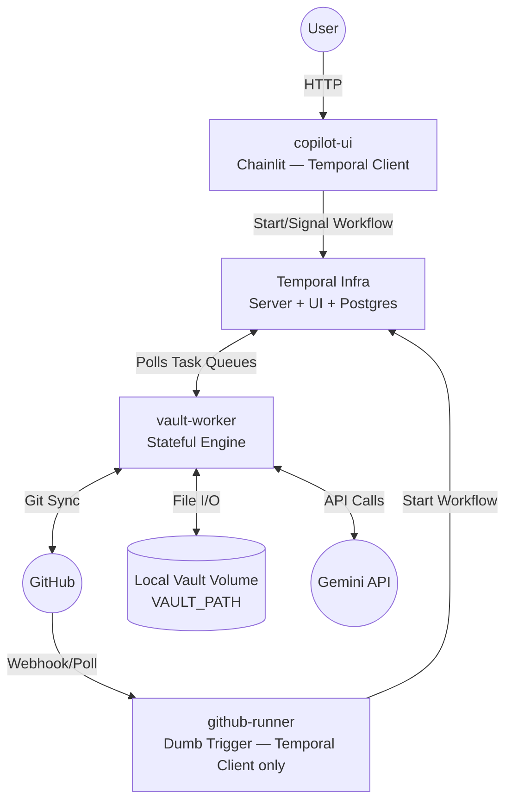

# Architecture

## Target Architecture (V2 — Temporal SOA)

> This is the architecture being implemented on the `feat/OBSE-P5-temporal-soa-migration` branch.
> New code must follow V2 patterns. See `TRD.md` for full specification and interface contracts.

### Container Diagram



**Container roster:**

| Container | Type | State |
| :--- | :--- | :--- |
| `postgres` | Infra (external image) | Stateful (DB volume) |
| `temporal-server` | Infra (external image) | Stateful (Postgres-backed) |
| `temporal-ui` | Infra (external image) | Stateless |
| `vault-worker` | Temporal Worker (custom) | Stateful (vault disk) |
| `copilot-ui` | Temporal Client (custom) | Stateless |
| `github-runner` | Temporal Client (custom) | Stateless |

### Monorepo Structure

```
obsidian-note-manager/
├── packages/
│   └── shared/
│       ├── models.py           # All Pydantic models
│       └── workflow_names.py   # Workflow/Signal/Query name constants
├── apps/
│   ├── vault-worker/
│   │   ├── workflows/          # All Workflow definitions
│   │   ├── activities/         # All Activity definitions
│   │   └── worker.py           # Worker registration (both queues)
│   ├── copilot-ui/             # Chainlit app (Temporal Client only)
│   └── github-runner/          # Runner Dockerfile + dumb-trigger scripts
├── tests/
│   ├── fixtures/dummy_vault/   # Synthetic vault for deterministic tests
│   ├── mocks/fake_llm.py       # Deterministic LLM responses
│   └── e2e/                    # Full workflow tests via temporalio.testing
├── .github/workflows/
│   ├── ci.yml                  # Run tests on PR
│   └── build-push.yml          # Build & push 3 custom images to GHCR on merge
├── TRD.md                      # Full technical specification
├── PLAN.md                     # Step status table (managed by orchestration loop)
└── docker-compose.prod.yml     # Full stack definition
```

### Workflow Hierarchy

All workflows and activities run inside the `vault-worker` container.

```
VaultManagerWorkflow          (long-running coordinator, well-known ID: "vault-manager")
  └── Handles: ensure_synced Updates from ReadVaultWorkflow

CopilotSessionWorkflow        (one per Chainlit session, ReAct agent loop)
  ├── ReadVaultWorkflow        (vault-default queue, parallel)
  ├── WriteVaultWorkflow       (vault-mutation-queue, serialised)
  └── LLM Generation Activities

NightWatchmanWorkflow         (triggered by github-runner, nightly cron)
  ├── ReadVaultWorkflow
  ├── WriteVaultWorkflow
  └── LLM Generation Activities

FilerIngestionWorkflow        (triggered by github-runner on Capture push)
  ├── ReadVaultWorkflow
  ├── [HITL pause — blocks on approve/reject Signal, timeout 1 week]
  └── WriteVaultWorkflow

ReadVaultWorkflow             (child — vault-default queue)
  └── Vault I/O Activities, Git Activities

WriteVaultWorkflow            (child — vault-mutation-queue, max concurrency: 1)
  └── Vault I/O Activities, Git Activities (always pull→write→push)
```

### Task Queue Design

| Queue | Used by | Concurrency |
| :--- | :--- | :--- |
| `vault-default` | All parent workflows, `ReadVaultWorkflow`, LLM Activities | Unlimited |
| `vault-mutation-queue` | `WriteVaultWorkflow` only | **Max 1** (global write serialisation) |

The `vault-mutation-queue` constraint is the distributed mutex for the file system. No two write workflows can overlap regardless of how many parent workflows are running.

### Activity Catalogue

All activities are **synchronous `def` functions** — never `async def`. The Temporal Python SDK runs them in a `ThreadPoolExecutor` automatically. Making them `async def` would stall the event loop.

Retry policies belong at the **call site** (`workflow.execute_activity(..., retry_policy=...)`), not on the `@activity.defn` decorator.

**Vault I/O:** `read_note`, `save_note`, `delete_note`, `list_notes_in`, `read_raw`, `scan_vault`, `validate_note`, `get_skeleton`, `get_code_registry`

**Git Operations:** `git_clone`, `git_pull`, `git_commit`, `git_push`

**LLM Generation:** `generate_proposal`, `generate_fix`

### Key Implementation Constraints

These are the patterns Serena checks on every PR. Violations cause rejection.

1. **Activities are `def`, not `async def`** — blocking libraries (GitPython, pathlib, frontmatter) must not run inside async coroutines.
2. **No file I/O inside `@workflow.run`** — all non-deterministic work goes in Activities.
3. **Retry policies at call site** — never on `@activity.defn`.
4. **`workflow.now()` returns UTC-aware datetime** — guard against naive datetime comparisons.
5. **`VaultManagerWorkflow` is auto-started** — never trigger it externally; it starts with the worker.
6. **Advanced Visibility requires PostgreSQL** — `list_workflows` with filters needs Postgres as the visibility store, not ElasticSearch.
7. **Coverage omit list** — add `apps/copilot-ui/app.py` to the pytest coverage omit list before running the 90% threshold check.

---

## Obsidian Domain Model (unchanged across V1 and V2)

### Vault Folder Structure

```
vault-root/
├── 00. Inbox/
│   ├── 0. Capture/              # Input: raw notes placed here trigger ingestion
│   ├── 1. Review Queue/         # Output: proposals awaiting human approval
│   ├── 00. Tag Glossary.md      # Context: tag definitions
│   └── 00. Code Registry.md     # Context: project codes
├── 20. Projects/                # Scanned by NightWatchman
├── 30. Areas/                   # Scanned by NightWatchman
├── 40. Resources/               # Indexed for linking
└── 99. System/
    └── maintenance_history.json
```

### Night Watchman Audit Rules

Scan scope: `20. Projects/` and `30. Areas/`. Excluded: `99. System`, `00. Inbox`, `.git`, `.obsidian`, `.trash`.

| Rule | Score | Condition |
| :--- | :--- | :--- |
| Missing metadata | +10 | Note has no aliases and no tags |
| Code mismatch | +50 | Filename stem does not begin with the expected project/area code. Not evaluated if Rule 3 also fires on the same file. |
| Generic filename | +20 | Filename stem (case-insensitive) is one of: `untitled`, `meeting`, `note`, `call` |

Produces fix proposals for the **up to 10 highest-scoring files**.

### Proposal Frontmatter Format

**Filing proposal** (output of `FilerIngestionWorkflow`):
```yaml
---
folders-to-create:
  - 20. Projects/New Project
files-to-create:
  - 20. Projects/New Project/Note.md
librarian: review
---
%%INSTRUCTIONS%%
...
---
%%ORIGINAL%%
...
---
%%FILE: 20. Projects/New Project/Note.md%%
...
```

**Maintenance proposal** (output of `NightWatchmanWorkflow`):
```yaml
---
type: file_change_proposal
target-file: 30. Areas/Existing/Note.md    # identifies the original file for update/rename
score: 60
reason: Missing aliases/tags, Missing Project Code
librarian: review
---
%%FILE: 30. Areas/Existing/CODE-Note.md%%
...
```

The `target-file` field is critical for maintenance proposals — it tells the filer this is an update, not a new file, and enables rename handling.

---

## Pre-Migration Architecture (V1 — Legacy)

> **Do not implement new code following V1 patterns. This section documents what is being replaced.**
> The V1 execution model (GitHub Actions + Raspberry Pi runner + `src_v2` monolith) is being
> superseded by the V2 Temporal SOA above. The mapping from V1 modules to V2 targets is in `TRD.md` §2.

### V1 Execution Model

- **Orchestrator:** GitHub Actions (self-hosted runner on Raspberry Pi)
- **Compute:** Docker container running `src_v2` Python monolith
- **Git operations:** Performed by the GitHub Actions workflow YAML, not Python
- **Testing:** Difficult — required mutating the actual vault or spending LLM credits

### V1 Entry Points (replaced)

| Entry Point | V1 Role | V2 Replacement |
| :--- | :--- | :--- |
| `src_v2.entrypoints.ingest_runner` | Runs ingestion pipeline | `FilerIngestionWorkflow` triggered by `github-runner` |
| `src_v2.entrypoints.cron_runner` | Runs maintenance pipeline | `NightWatchmanWorkflow` triggered by `github-runner` |
| `src_v2.entrypoints.chainlit_app` | Chainlit with direct vault access | `copilot-ui` using Temporal Client only |

### V1 GitOps Boundary (superseded)

In V1, Python mutated files and the GitHub Actions YAML ran all git operations. In V2, the `WriteVaultWorkflow` owns the full `git pull → write → git commit → git push` sequence as Activities, and the `vault-mutation-queue` provides serialisation. GitHub Actions is retained only as a dumb trigger that starts a Temporal workflow.
