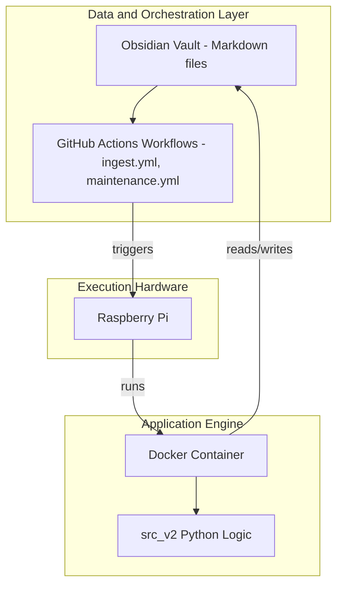

# Architecture Overview

## Tri-Part Architecture

The Obsidian Note Automation system consists of three distinct layers that work together:



### 1. Data & Orchestration Layer (obsidian-notes repo)

- **Markdown vault**: The actual Obsidian notes, folders, and metadata
- **GitHub Actions workflows**: `.github/workflows/ingest.yml` and `maintenance.yml` define when and how the automation runs
- **Workflow templates**: Stored in `obsidian-note-manager/example/workflows/`; must be copied to the vault repo to function

### 2. Execution Hardware (Raspberry Pi)

- Hosts the GitHub Actions self-hosted runner daemon
- Receives job dispatches from GitHub when workflows trigger
- Runs the Docker container that executes the Python application

### 3. Application Engine (Docker Container)

- Built from `obsidian-note-manager` repository
- **Stateless**: Pre-loaded with `src_v2` application code
- **Injected**: `.env` secrets (GITHUB_PAT, GEMINI_API_KEY, etc.) at runtime
- **Executes**: Python logic when triggered by the runner (ingest_runner, cron_runner)

---

## GitOps Boundary

**Critical design principle**: The Python application **only mutates files**. It contains **no Git logic**.

| Responsibility | Where it lives |
|----------------|----------------|
| Read/write vault files | Python (`src_v2`) |
| `git add`, `git commit`, `git push` | GitHub Actions workflow steps |

The workflows perform all Git operations after the Python script completes. This keeps the application stateless and testable, and ensures Git authentication is handled by GitHub Actions' built-in `GITHUB_TOKEN`.

---

## Three Modes of Operation

### 1. Manual

Direct human interaction with Obsidian. No automation runs. Users edit notes, create folders, and organize the vault by hand.

### 2. Asynchronous Automation (Night Watchman)

- **Entry point**: `python3 -m src_v2.entrypoints.cron_runner`
- **Trigger**: `maintenance.yml` (scheduled daily at 02:00 UTC, or `workflow_dispatch`)
- **Purpose**: Audits the vault against conventions, scores quality deficits, generates fix proposals, logs offenders to Review Queue

### 3. Event-Driven Ingestion

- **Entry point**: `python3 -m src_v2.entrypoints.ingest_runner`
- **Trigger**: `ingest.yml` (push to `00. Inbox/0. Capture/` or `00. Inbox/1. Review Queue/`, or `workflow_dispatch`)
- **Purpose**: Files approved proposals (`librarian: file`), ingests new notes from Capture via LLM, writes proposals to Review Queue

---

## Pipeline Architecture

```
┌─────────────────────────────────────────────────────────────────────────────┐
│                    DATA & ORCHESTRATION (obsidian-notes repo)                │
│                                                                             │
│  ┌─────────────────────┐      ┌─────────────────────┐                      │
│  │ 00. Inbox/          │      │ 20. Projects/       │                      │
│  │   0. Capture/       │      │ 30. Areas/          │                      │
│  │   └─ Raw notes      │      │   └─ Existing notes │                      │
│  └─────────────────────┘      └─────────────────────┘                      │
│           │                            │                                    │
│           │ Git Push                   │ Scheduled/Manual                  │
│           ▼                            ▼                                    │
│  ┌─────────────────────┐      ┌─────────────────────┐                      │
│  │ ingest.yml           │      │ maintenance.yml     │                      │
│  │ (GitHub Actions)      │      │ (GitHub Actions)    │                      │
│  └─────────────────────┘      └─────────────────────┘                      │
│           │                            │                                    │
│           └──────────┬─────────────────┘                                    │
│                      │                                                      │
│                      ▼                                                      │
│  ┌─────────────────────────────────────────────────────────────────────┐   │
│  │ APPLICATION ENGINE (Docker container on Raspberry Pi)                 │   │
│  │                                                                      │   │
│  │  ingest_runner.py          cron_runner.py                            │   │
│  │  ├─ FilerService           ├─ MaintenanceService                     │   │
│  │  └─ IngestionService       └─ LibrarianService (Code Registry)       │   │
│  │                                                                      │   │
│  │  Shared: ObsidianFileSystemAdapter, GeminiAdapter                    │   │
│  └─────────────────────────────────────────────────────────────────────┘   │
│                      │                                                      │
│                      │ Python mutates files only                            │
│                      │ Workflows run: git add, commit, push                  │
│                      ▼                                                      │
│  ┌────────────────────────┐                                                │
│  │ 00. Inbox/1. Review    │ ◄── Human Review Point                         │
│  │   └─ Proposals         │     User sets librarian: file to approve       │
│  └────────────────────────┘                                                │
│                      │                                                      │
│                      ▼                                                      │
│  ┌────────────────────────┐                                                │
│  │ Final Vault Locations   │                                                │
│  │ 20. Projects/...        │                                                │
│  │ 30. Areas/...           │                                                │
│  └────────────────────────┘                                                │
└─────────────────────────────────────────────────────────────────────────────┘
```

---

## Pipeline Details

### Ingestion Pipeline (The Librarian)

Triggered by Git push to Capture or Review Queue, or `workflow_dispatch`.

```
┌─────────────────────────────────────────────────────────────────┐
│                    INGESTION PIPELINE FLOW                       │
│                                                                  │
│  ingest_runner.py orchestrates the pipeline                      │
│     │                                                            │
│     ├─► Phase 1: FILE APPROVED PROPOSALS                         │
│     │   └─► FilerService.file_approved_notes()                  │
│     │       ├─ Scans Review Queue for librarian: file            │
│     │       ├─ Parses %%FILE%% blocks via response_parser         │
│     │       ├─ Handles maintenance fixes (target-file)            │
│     │       ├─ Creates files with collision protection            │
│     │       └─ Deletes processed proposals                        │
│     │                                                            │
│     ├─► Phase 2: PROCESS NEW NOTES                               │
│     │   └─► IngestionService.run()                               │
│     │       ├─ Extracts LLM-Instructions from note                 │
│     │       ├─ Loads vault context (ContextConfig)                 │
│     │       ├─ Calls Gemini API (GeminiAdapter)                   │
│     │       ├─ Parses response (parse_proposal)                   │
│     │       └─ Creates proposal note with frontmatter             │
│     │                                                            │
│     └─► Phase 3: COMMIT CHANGES (in workflow, not Python)          │
│         └─► Workflow steps: git add, git commit, git push        │
└─────────────────────────────────────────────────────────────────┘
```

### Maintenance Pipeline (Night Watchman)

Triggered by scheduled cron (daily 02:00 UTC) or `workflow_dispatch`.

```
┌─────────────────────────────────────────────────────────────────┐
│                 MAINTENANCE PIPELINE FLOW                        │
│                                                                  │
│  cron_runner.py orchestrates the pipeline                        │
│     │                                                            │
│     ├─► Phase 1: SCAN VAULT                                      │
│     │   └─► MaintenanceService.audit_vault()                     │
│     │       ├─ Scans 20. Projects/ and 30. Areas/                │
│     │       ├─ Scores files for quality deficits:                  │
│     │       │   ├─ Missing aliases/tags (+10)                     │
│     │       │   ├─ Missing project code (+50)                     │
│     │       │   └─ Generic filename (+20)                         │
│     │       └─ Returns sorted candidate list                      │
│     │                                                            │
│     ├─► Phase 2: FILTER CANDIDATES                                │
│     │   └─► Filter by cooldown (7 days), skip recently modified   │
│     │                                                            │
│     ├─► Phase 3: GENERATE FIX PROPOSALS                          │
│     │   └─► AssistantService / MaintenanceService                 │
│     │       ├─ Reads original file content                        │
│     │       ├─ Constructs maintenance instructions                │
│     │       ├─ Calls LLM for fix proposal                         │
│     │       ├─ Creates proposal with target-file metadata         │
│     │       └─ Writes to Review Queue                             │
│     │                                                            │
│     └─► Phase 4: RECORD HISTORY                                   │
│         └─► Saves to 99. System/maintenance_history.json          │
│                                                                  │
│     └─► Phase 5: COMMIT CHANGES (in workflow, not Python)         │
│         └─► Workflow steps: git add, git commit, git push         │
└─────────────────────────────────────────────────────────────────┘
```

---

## Key Components (src_v2 Clean Architecture)

### Entry Points

| Component | Module | Purpose |
|-----------|--------|---------|
| Ingestion | `src_v2.entrypoints.ingest_runner` | Headless Capture-to-Review-Queue pipeline |
| Maintenance | `src_v2.entrypoints.cron_runner` | Night Watchman audit and fix proposals |
| CLI | `src_v2.entrypoints.cli` | Manual commands (update-registry, audit, fix, blueprint) |

### Use Cases

| Service | Purpose |
|---------|---------|
| IngestionService | Processes new notes from Capture via LLM |
| FilerService | Executes approved proposals (creates/moves files) |
| MaintenanceService | Scans vault, generates fix proposals |
| LibrarianService | Code Registry table generation |
| AssistantService | Blueprint generation, fix proposals |

### Core (Domain & Interfaces)

| Layer | Module | Purpose |
|-------|--------|---------|
| core/domain | models.py | Note, Frontmatter, ValidationResult, CodeRegistryEntry, Link |
| core/interfaces | ports.py | VaultRepository, LLMProvider (abstract ports) |
| core | response_parser.py, vault_utils.py | Parse %%FILE%% blocks, path safety |

### Infrastructure (Adapters)

| Adapter | Implements | Purpose |
|---------|------------|---------|
| ObsidianFileSystemAdapter | VaultRepository | File system operations on vault |
| GeminiAdapter | LLMProvider | Google Gemini API |
| MockVaultAdapter, FakeLLM | Testing | Test doubles |

### Infrastructure (Deployment)

| Component | Location | Purpose |
|-----------|----------|---------|
| Dockerfile | Repo root | Container image (copies src_v2, pip install) |
| docker-compose.yml | Repo root | Container orchestration |
| entrypoint.sh | scripts/ | Runner registration and startup |
| token_fetcher.py | scripts/ | Fetches runner registration token via PAT |

---

## Obsidian Vault Structure

The system expects this vault structure:

```
vault-root/
├── 00. Inbox/
│   ├── 0. Capture/              # Input: Raw notes placed here
│   ├── 1. Review Queue/         # Output: Proposals for human review
│   ├── 00. Tag Glossary.md      # Context: Tag definitions
│   └── 00. Code Registry.md     # Context: Project codes (optional, auto-scanned)
├── 20. Projects/                # Scanned by maintenance
│   └── {Project folders}/
├── 30. Areas/                   # Scanned by maintenance
│   └── 4. Personal Management/
│       └── Obsidian/
│           └── Obsidian System Instructions.md  # Context: Rules
├── 40. Resources/               # Indexed for linking
└── 99. System/
    └── maintenance_history.json # Maintenance scan history
```

---

## Data Flow

### Ingestion Flow

1. **User Action**: User creates note in `00. Inbox/0. Capture/` and pushes to GitHub
2. **Trigger**: GitHub Actions workflow (ingest.yml) detects push
3. **Job Dispatch**: Workflow runs on self-hosted runner
4. **Checkout**: Workflow checks out vault to workspace
5. **Phase 1 - Filing**: FilerService checks for approved proposals (`librarian: file`)
6. **Phase 2 - Processing**: IngestionService processes each note in Capture via LLM
7. **Phase 3 - Git**: Workflow steps run `git add`, `git commit`, `git push`
8. **User Review**: User reviews proposals and sets `librarian: file` to approve

### Maintenance Flow

1. **Trigger**: Scheduled cron or `workflow_dispatch`
2. **Checkout**: Workflow checks out vault
3. **Scan**: MaintenanceService identifies quality issues in Projects/Areas
4. **Filter**: Cooldown and conflict checks
5. **Fix Generation**: AssistantService/MaintenanceService creates proposals via LLM
6. **Record**: Scan history saved
7. **Git**: Workflow steps run `git add`, `git commit`, `git push`
8. **User Review**: User reviews proposals and approves fixes

---

## Proposal Types

### Regular Proposals (Ingestion)

```yaml
---
folders-to-create:
  - 20. Projects/New Project
files-to-create:
  - 20. Projects/New Project/Note.md
librarian: review
---
%%INSTRUCTIONS%%
...
---
%%ORIGINAL%%
...
---
%%FILE: 20. Projects/New Project/Note.md%%
...
```

### Maintenance Proposals (Fix)

```yaml
---
type: file_change_proposal
target-file: 30. Areas/Existing/Note.md    # Critical: identifies original file
score: 60
reason: Missing aliases/tags, Missing Project Code
librarian: review
---
%%INSTRUCTIONS%%
...
---
%%ORIGINAL%%
...
---
%%FILE: 30. Areas/Existing/CODE-Note.md%%  # May include rename
...
```

The `target-file` metadata is crucial for maintenance fixes:
- Tells the filer this is an update, not a new file
- Enables proper handling of renames (original deletion)
- Prevents creation of duplicate files (Note.md, Note-1.md, Note-2.md)

---

## Security & Authentication

### GitHub Authentication
- **Personal Access Token (PAT)**: Used for automatic runner registration
  - Required: Classic PAT with `repo` scope
  - Stored: Environment variable `GITHUB_PAT` in `.env` file
- **Registration Token**: Auto-fetched using PAT (expires after 1 hour)
- **GITHUB_TOKEN**: Workflow token for checkout/push (managed by GitHub Actions)

### API Keys
- **GEMINI_API_KEY**: Stored in GitHub Secrets, passed to workflow

### Safety Mechanisms
- **Path Traversal Protection**: Filer validates paths contain no `..` or absolute paths
- **Collision Protection**: `get_safe_path()` prevents overwriting unrelated files
- **Conflict Detection**: Maintenance skips files modified within 1 hour
- **Cooldown Period**: Files aren't re-scanned within 7 days

---

## Technology Stack

- **Containerization**: Docker, Docker Compose (repo root)
- **Orchestration**: GitHub Actions (self-hosted runner)
- **Runtime**: Python 3.10+
- **AI/ML**: Google Gemini API (`google-generativeai` SDK)
- **Markdown Processing**: `python-frontmatter` library
- **Runner**: GitHub Actions Runner v2.331.0+ (auto-updates)
